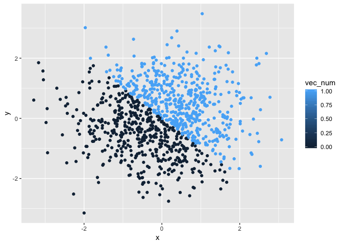

Solutions to Problem 1 & 2
================
Yizhi Ma
2018-09-21

Problem 1
=========

``` r
## Set up the data frame for problem 1
prob1_df = tibble(
  unif_sample = runif(10, min =0, max = 5),
  logi_sample = unif_sample > 2,
  chara_sample = as.character(logi_sample),
  factor_sample = factor(chara_sample)
)
```

Problem 2
=========

``` r
## Set up the data fraame for problem 2
prob2_df = tibble(
  x = rnorm(1000, sd = .5),
  y = rnorm(1000, sd = .5),    
  vec_logi = x+y > 0,
  vec_num = as.numeric(vec_logi),
  vec_factor = as.factor(vec_logi)
)
```

``` r
## Scatter plot of x and y, color using logical vector
ggplot(prob2_df, aes(x = x, y = y, color = vec_logi)) + geom_point()
```


``` r
## Scatter plot of x and y, color using numerical vector
ggplot(prob2_df, aes(x = x, y = y, color = vec_num)) + geom_point()
```



``` r
## Scatter plot of x and y, color using factor vector
ggplot(prob2_df, aes(x = x, y = y, color = vec_factor)) + geom_point()
```


